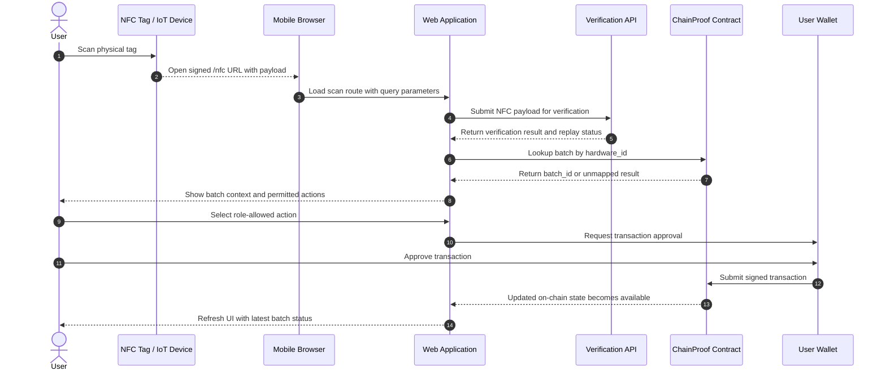

# End-to-End Sequence Diagram

## Overview
This diagram shows the full operational flow from NFC scan to on-chain transaction. It focuses on the main sequence of events in the ChainProof system: scan, verification, batch lookup, user action, wallet approval, and contract state update.

Figure: End-to-end sequence diagram for the ChainProof workflow, showing how an NFC scan is verified, resolved to a batch, and converted into a role-authorized blockchain transaction.

## Interpretation
The sequence begins when the user scans an NFC-enabled device attached to a physical batch. The scan opens the deployed web application with a signed payload generated by the IoT firmware. The application then forwards that payload to the verification API, which checks authenticity and replay validity before the batch is resolved through the smart contract's hardware-to-batch mapping.

Once the batch context is restored, the user is shown only the actions allowed for their role. If the user initiates a state-changing operation, the application requests approval from the connected wallet. After approval, the signed transaction is submitted to the smart contract, and the resulting on-chain state is read back into the interface. This sequence illustrates how the system links physical interaction, verification, user authorization, and blockchain state management in one continuous workflow.
