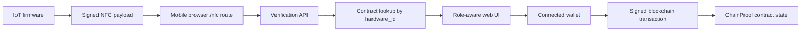

# Implementation Details

## Overview
The ChainProof implementation is composed of three coordinated subsystems: the smart contract layer, the web application layer, and the IoT firmware layer. Together, these subsystems enable a physical batch to be identified by NFC, resolved into a digital batch record, and processed through role-controlled custody actions. This section describes how the main implementation areas were constructed and how they interact in practice.

## Implementation Structure

| Area | Main Location | Implementation Role |
| --- | --- | --- |
| Smart contract | `services/smart-contracts/contracts/ChainProof.sol` | Stores batch state, role assignments, custody transitions, and hardware-to-batch mapping |
| Web application | `services/web` | Provides the user interface, scan handling, verification flow, and wallet-driven transaction submission |
| IoT firmware | `services/iot/blink/main/main.c` | Collects sensor context, builds signed NFC payloads, and publishes the hardware identifier |
| Wallet authentication | `services/web/components/auth/wallet-auth-context.tsx` | Connects wallets, reconciles chain/account state, and resolves the user's on-chain role |
| NFC verification | `services/web/app/api/nfc/verify/route.ts` | Accepts scan payloads and validates authenticity before the application uses them |

## Smart Contract Implementation
The smart contract is implemented in `ChainProof.sol` and acts as the authoritative source of truth for the supply-chain state. It stores actor roles, batch records, current handlers, pending recipients, and the mapping between a hashed hardware identifier and the active batch. Each batch contains core metadata such as origin, IPFS reference, weight, tracking code, timestamps, and current custody information.

The contract enforces business rules directly at the write layer. Producers can create batches and bind hardware identifiers. Warehouses and transporters can receive and transfer custody when they are the current handler. The contract also stores parent-child relationships for split operations so that lineage can still be traced through downstream handling. This design ensures that custody changes are not merely UI decisions but validated state transitions enforced on-chain.

## Web Application Implementation
The web platform is implemented with Next.js in `services/web`. Its role is to coordinate user interaction, scan handling, role-aware routing, and contract access. The web application does not act as the final authority for permissions; instead, it provides the interface through which authorized users trigger smart contract operations.

The application includes read and write helpers for contract access. Read helpers resolve batches by tracking code, batch id, or hardware identifier and assemble timeline information for presentation in dashboards and tracking views. Write helpers submit transactions for batch creation, transfer initiation, and receipt using the connected wallet signer. This separation between read and write logic improves maintainability and keeps blockchain-specific behavior centralized.

## IoT Firmware Implementation
The IoT firmware is implemented in `services/iot/blink/main/main.c`. It runs on the embedded device attached to the physical batch and is responsible for generating the data that enters the NFC workflow. The firmware reads environmental values, maintains counters such as boot and scan sequence identifiers, and writes a signed URI payload to the NFC-capable memory component.

The payload includes the `hardware_id`, telemetry values, monotonic counters, payload version, and signature. These fields allow the downstream system to identify the correct hardware unit, detect stale or replayed scans, and restore physical context at the point of interaction. In implementation terms, the firmware is not responsible for deciding which actor may control a batch. Its purpose is to expose trustworthy scan data that the rest of the platform can verify and interpret.

## NFC Flow Implementation
The NFC flow begins when the firmware writes a signed URI payload that points to the deployed web application's `/nfc` route. A mobile device scans the tag and opens that route directly in the browser. The web application parses the query parameters, forwards the payload to `/api/nfc/verify`, and receives a verification result that confirms authenticity and replay status.

After verification, the application resolves the `hardware_id` to a batch identifier by querying the smart contract mapping. If a mapping exists, the batch is treated as recognized and its context is restored into the user session. If a mapping does not yet exist, the producer workflow can create a new batch and bind that hardware identifier so future scans resolve immediately. This implementation makes NFC the entry point into the operational workflow rather than a separate isolated feature.

## Wallet Authentication Implementation
Wallet authentication is implemented through the web application's wallet context in `wallet-auth-context.tsx`. The system supports connector-based wallet access and uses wallet session data to determine the active address and chain. It then reconciles that information with the configured project chain and queries on-chain role information to determine whether the user is acting as a producer, warehouse, or transporter.

This approach allows identity and permissions to remain tied to blockchain accounts rather than to a separate username-password system. The implementation also keeps wallet signing user-initiated, meaning the application may prepare or request an action but the final state-changing transaction must still be approved by the connected wallet.

## Data Flow Implementation
The main data flow of the system moves across three stages. First, the IoT device produces signed scan data and exposes it through the NFC tag. Second, the web application verifies that data, restores batch context, and determines the actor's role. Third, the smart contract validates and stores any resulting custody action.

Figure: Implementation data flow from firmware-generated NFC data to role-aware web interaction and final on-chain state update.

In practical terms, this means the firmware produces identification data, the web layer interprets and validates it, and the blockchain layer commits the authoritative result. The benefit of this implementation is that no single layer is responsible for the entire workflow. Instead, each layer contributes a specific function: the firmware supplies physical identity, the web application manages interaction and validation, and the smart contract preserves the final trusted record.

## Integration of the Implementation Layers
The implementation is effective because the three layers are tightly connected but still clearly separated in responsibility. The IoT layer bridges the physical and digital environments, the web layer manages workflow execution and usability, and the smart contract layer guarantees traceable and permissioned state transitions. This modular implementation makes the project suitable both as a practical prototype and as a demonstrable academic system for decentralized supply-chain tracking.
