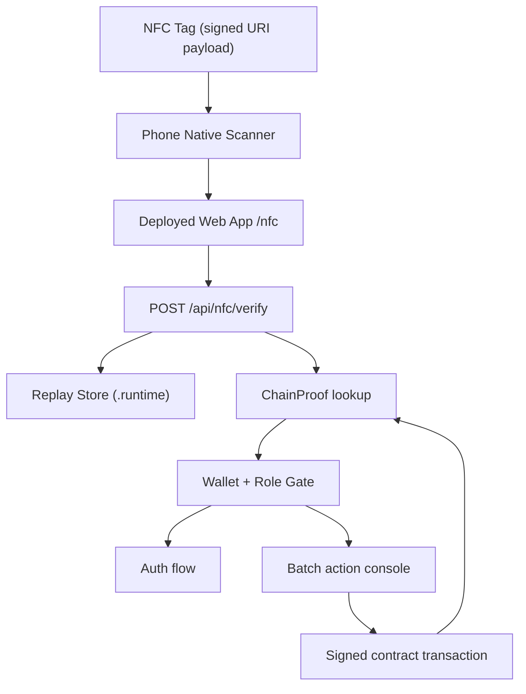

# Integration Context (Web ↔ IoT ↔ Contract)

## Purpose
This document explains how a physical scan moves through the deployed website and into the contract-backed supply-chain workflow. The integration centers on one practical goal: scanning the IoT hardware should let the platform recognize the correct batch and present the right actions for the connected actor.

## End-to-End Integration Flow
1. Firmware writes a signed NFC payload that includes `hardware_id`, counters, telemetry, and signature data.
2. A phone scan opens the deployed web application's `/nfc` route.
3. The web app sends the payload to `/api/nfc/verify` for signature and replay validation.
4. After verification, the platform resolves `hardware_id -> batch_id` from `ChainProof`.
5. The user is routed according to wallet state and assigned role.
6. The UI shows only the actions permitted for that actor on that batch.
7. Submitted transactions update on-chain custody, and the app refreshes from the latest contract state.

## Integration Responsibilities
- **IoT firmware**
  - Publishes the signed scan payload.
  - Supplies the `hardware_id` that the platform uses to recognize a batch.
- **Web application**
  - Verifies the payload.
  - Restores batch context and session context.
  - Presents the correct workflow for the connected role.
- **Smart contract**
  - Resolves hardware mapping.
  - Stores custody state.
  - Enforces allowed actor actions.

## Actor Permissions in the Integrated Flow
- **Producer**
  - Creates the batch record.
  - Binds hardware so future scans can resolve the batch immediately.
  - Initiates the first handoff to warehouse or transporter custody.
- **Warehouse**
  - Receives batches into storage custody.
  - Can dispatch a batch onward when the warehouse is the current handler.
  - Can split a batch into smaller units when that supports inventory handling.
- **Transporter**
  - Receives custody for movement between operational locations.
  - Holds the batch while it is in transit.
  - Hands the batch to the next approved actor through a transfer flow.

## Data Across Boundaries
- **Firmware -> Web**
  - `v`, `hardware_id`, `boot_id`, `nfc_seq`, `sample_seq`, telemetry fields, and `sig`.
- **Web -> Session/UI**
  - Verification result, replay result, resolved batch id, and scan context.
- **Web -> Contract**
  - Role-aware write actions such as batch creation, hardware binding, transfer initiation, batch receipt, and warehouse split operations.

## Hardware Recognition Model
- The NFC payload is read-only from the operator's perspective.
- `hardware_id` is the bridge between the physical device and the digital batch record.
- The contract keeps the authoritative hardware-to-batch mapping.
- Hardware binding is primarily a lookup capability so the platform can recognize a batch from a scan; it is not treated as a public supply-chain milestone.

## Operational Assumptions
- The deployed website and the configured contract address reference the same target chain.
- Wallet signing remains user-initiated even when the scan begins the workflow.
- Runtime verification artifacts under `services/web/.runtime` remain out of version control.
