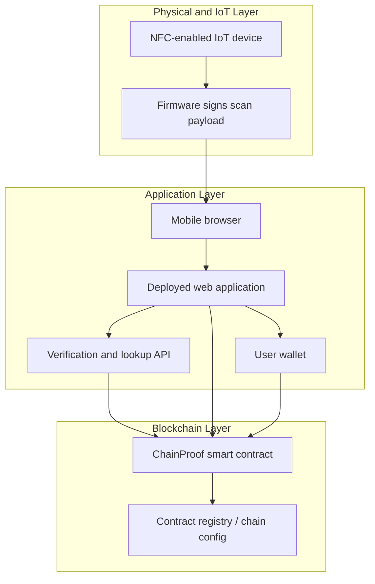

# System Architecture

## Overview
The ChainProof system follows a layered architecture that connects physical batch identification, web-based user interaction, and blockchain-enforced custody management. Its purpose is to ensure that a physical batch can be recognized through an NFC scan, linked to a digital record, and acted on only by the appropriate actor within the supply chain. Within the current project scope, the operational actors are the producer, warehouse, and transporter.

The architecture is divided into three main layers. The first is the physical and IoT layer, where NFC-enabled hardware carries a signed payload containing the `hardware_id` and scan metadata. The second is the application layer, implemented as a deployed web platform that verifies scan data, restores the batch context, manages wallet sessions, and presents actor-specific actions. The third is the blockchain layer, where the `ChainProof.sol` smart contract stores authoritative state for roles, custody, transfers, and hardware-to-batch recognition.

## Architectural View

Figure: High-level system architecture of ChainProof, showing the interaction between NFC-enabled IoT hardware, the deployed web platform, user wallet, and blockchain contract layer.

## Layer Responsibilities

| Layer | Main Components | Primary Responsibility |
| --- | --- | --- |
| Physical and IoT Layer | NFC-enabled hardware, firmware | Publishes signed scan data and exposes the hardware identifier attached to a batch |
| Application Layer | Mobile browser, web app, verification API, wallet integration | Verifies scans, restores batch context, authenticates users, and presents role-specific workflows |
| Blockchain Layer | `ChainProof.sol`, contract registry, deployed chain | Stores batch state, enforces permissions, records custody transitions, and resolves hardware mapping |

## Scan-to-Action Flow
The architecture is organized around a scan-to-action workflow. When an NFC tag is scanned, the phone opens the deployed web application with the signed payload. The application sends this payload to the verification endpoint, which checks authenticity and replay constraints before resolving the `hardware_id` to the correct batch through the smart contract. Once the batch is identified, the connected wallet address is used to determine the actor's role. The interface then exposes only the operations permitted for that role. If the actor performs a state-changing action, such as creating a batch, initiating a transfer, or receiving custody, the action is submitted as a blockchain transaction signed by the wallet and then refreshed from on-chain state.

## Trust Boundaries
An important feature of the architecture is the separation of responsibilities across trust boundaries. The IoT device provides signed identification data, but it does not decide permissions or modify custody state. The web application provides orchestration, validation, and usability, but it is not the final authority for business rules. The smart contract is the trust anchor of the system because it enforces role-based permissions and stores the canonical batch record. This separation improves auditability and reduces the risk of unauthorized off-chain state changes.

## Role-Based Interaction Model
Role-based access is central to the architecture. The producer creates new batches and binds hardware identifiers so later scans can immediately restore the correct batch context. The warehouse receives custody, stores goods, and may split batches into smaller operational units when required. The transporter receives batches for transit and transfers them onward to the next approved actor. By enforcing these permissions at the contract layer, the architecture ensures that custody transitions are both verifiable and traceable.

## Architectural Rationale
This architecture was chosen to balance usability, traceability, and integrity. The IoT layer creates the link between the physical batch and its digital identity. The web platform provides an accessible interface for real users while handling verification and routing logic. The blockchain layer guarantees that critical business rules, such as who may control a batch and when custody changes occur, are enforced consistently. Together, these layers form an end-to-end architecture suited to a decentralized supply-chain tracking system.
